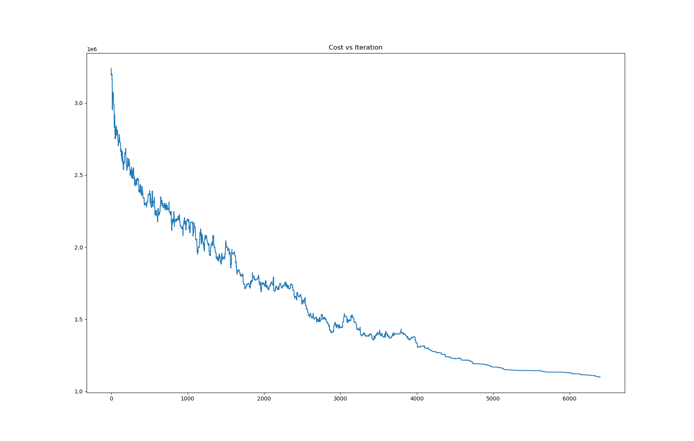
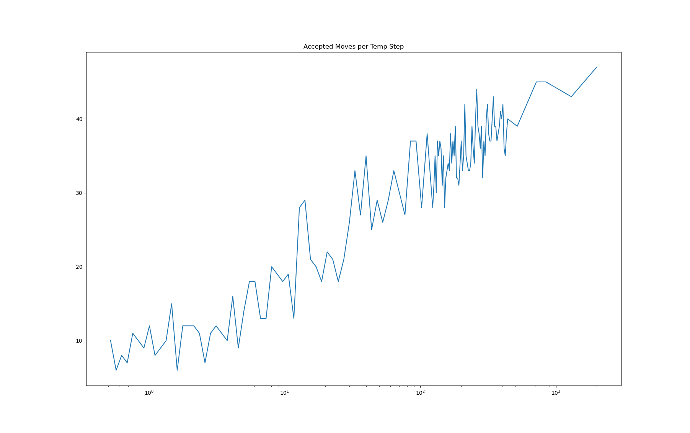

# PA2 #
## Phase 1 ##
### File Descriptions ###
* ``input_parser``: class designed to parse the input file. Currently only parses the node names.
* ``sizer``: class that performs the forward and backward traversal of the tree. 
* ``main``: executes the different portions of the problem and also has the function to create an initial string. This function will most likely be moved to an annealing class for phase 2.

### Known Issues ###
* I forgot about the existence of multi-digit numbers and therefore the program doesn't work with anything more than 0-9. 
    * To fix this, I could make the polish expression an array of chars/strings and instead of indexing into a char array, index into that array.
    * The sizes are already working so this should be a simple fix

## Phase 2 ##
### Execution ###
* The program can be compiled using the ``make`` command on a Unix system
* While in the folder in which the project is contained, use the command:
    * ``./main PA2_Benchmarks/<circuit_file_name>.fp -<arg>``
* Where ``<circuit_file_name>`` is the name of the circuit you'd like to perform annealing on 
* And ``<arg>`` is the option: c, a, or w

### File Descriptions ###
* ``annealing_engine``: contains the annealing engine itself as well as the constants defined in the header file.
* ``sizer``: Contains the class that performs sizing on an individual polish expression. Mostly implemented in Phase 1.
* ``input_parser``: Parses the circuit file to extract the shapes and edges.
*``main.``: Runs the programs in order and accepts inputs from the user.

### Known Issues ###
* There are no known issues in this version. I have fixed the issues from phase 1 and successfully implemented the annealing engine

### Run Results ###
* Note I was running a rather CPU-intensive program for another class when I took some of these results

| Ckt name | Argument | Chip Width | Chip Height | HPWL | Real-time | User-CPU-Time | Sys-CPU-Time |
|:---------|:---------|:-----------|:------------|:-----|:----------|:--------------|:-------------|
|n10       |-a        |568         |515          |28725.5|0.114 s   |0.114 s        |0.000 s       |
|n10       |-w        |439         |932          |19822 |0.111 s    |0.110 s        |0.000 s       |
|n10       |-c        |600         |556          |31600 |0.112 s    |0.111 s        |0.000 s       |
|n30       |-a        |365         |1141         |105912|0.426 s    |0.406 s        |0.000 s       |
|n30       |-w        |579         |914          |62266.5|0.395 s   |0.394 s        |0.000 s       |
|n30       |-c        |510         |704          |85604 |0.400 s    |0.399 s        |0.000 s       |
|n50       |-a        |546         |718          |174046|0.789 s    |0.786 s        |0.000 s       |
|n50       |-w        |977         |658          |177532|0.822 s    |0.821 s        |0.000 s       |
|n50       |-c        |603         |751          |182510|0.812 s    |0.811 s        |0.000 s       |
|n100      |-a        |544         |824          |402093|2.229 s    |2.228 s        |0.000 s       |
|n100      |-w        |731         |900          |326823|2.386 s    |2.384 s        |0.000 s       |
|n100      |-c        |678         |639          |313638|2.188 s    |2.184 s        |0.000 s       |
|n300      |-a        |1005        |953          |1.726e+6|10.337 s |10.333 s       |0.000 s       |
|n300      |-w        |1239        |1301         |1.458e+6|10.806 s |10.796 s       |0.004 s       |
|n300      |-c        |782         |1249         |1.248e+6|10.502 s |10.462 s       |0.000 s       |

### Observations ###
* I used a python script to graph the cost and number of accepted moves per time step. This showed many interesting properties. 
    * The outputs of a run of n300 with the -c flag can be found in ``cost.txt`` and ``accepted_moves.txt``
    * The Python script can be run using the following commands:
        * ``python grapher.py -f a -i accepted_moves.txt`` to show the accepted moves per temp step
        * ``python grapher.py -i cost.txt`` to show the cost per iteration
    *The graphs that these output are below

 

* I found that I didn't need to have my initial temperature nearly as high as I had it at first to get good results. I ended up decreasing it from 40000 to 2000
* I also found that I dind't need to accept nearly as many moves at the beginning, ending up with an 80% acceptance rate
* My schedule consisted of four segments
    * Decreasing the temp by 65% for the first half 
    * Decreasing the temp by 85% for the third quarter
    * Decreasing the temp by 98% between 4/16 and 1/16
    * Decreasing the temp by 91% for the last 1/16
* I came up with this schedule through trial and error and looking at the graphs
* I noticed that there was way too much time spent jumpting around at the beginning, so I shortened the temperature range and made it decrease faster there.
* I also noticed that the most difference was made between 4/16 and 1/16, which caused me to put the most weight on this section.
* Finally, I wanted to make sure that the last section of the program had enough time to effectively converge on a good solution, thus giving me the 91% I used.